> 끊임없이 배우고, 끊김없이 소통하는 개발자가 되겠습니다.
***

### 목차
* [경력](#경력)
* [회사 프로젝트](#회사-프로젝트)
* [개인 프로젝트](#개인-프로젝트)
***

## 경력
>[로웸](http://www.rowem.com) (정직원)
>* 2018.03 ~ 2019. 08
>* 안드로이드 애플리케이션 개발 및 유지보수 (보안 솔루션, 팬덤 플랫폼)

>[이케이시스](http://www.eksys.co.kr) (프리랜서)
>* 2017.04 ~ 2017. 08
>* 안드로이드 애플리케이션 개발 (차량관제)

>[인라이플](http://www.enliple.com) (정직원)
>* 2016.02 ~ 2016. 10
>* 안드로이드 애플리케이션 개발 및 유지보수 (광고SDK, 모바일 쇼핑몰)

>[로커스데이터](http://www.rowem.com) (정직원)
>* 2015.09 ~ 2015. 12
>* 안드로이드 애플리케이션 개발 (비콘 연동)

>프리랜서
>* 2013.11 ~ 2015. 07
>* 안드로이드 애플리케이션 개발 (T멤버십, 식단정보, 보안카드)

>[와이즈스톤](http://wisestone.kr) (정직원)
>* 2011.10 ~ 2013. 10
>* 안드로이드 애플리케이션 개발 (신한카드, 중고장터, 모바일 오피스)

>FIH Technology Korea (정직원)
>* 2010.04 ~ 2011. 06
>* 안드로이드 애플리케이션 개발 및 포팅 (2.1, 2.2기반)
***

## 회사 프로젝트
>패시키
>* 보안 로그인 솔루션
>* 개발 기간 : 2019.02 ~ 2019.08
>* 사용 기술 : Kotlin, Gitlab, Retrofit, Glide, Room, Aes-256, SHA-512, Zxing

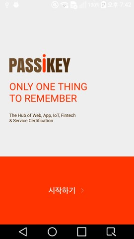    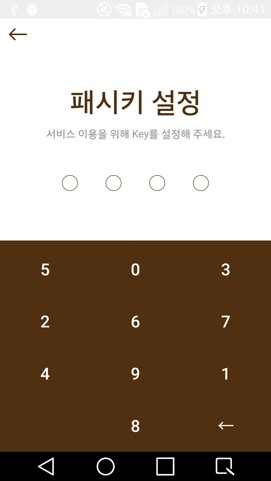  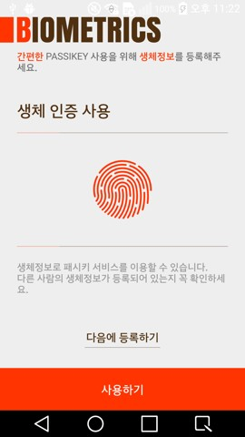 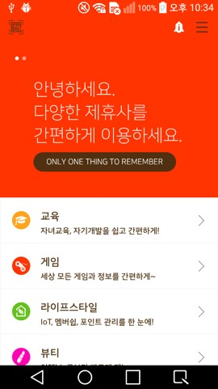  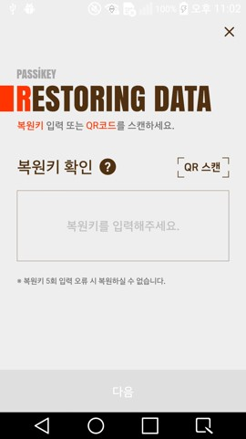
***

>[스타패스](https://play.google.com/store/apps/details?id=inc.rowem.passicon)
>* 아이돌 팬덤 플랫폼
>* 개발 기간 : 2018.03 ~ 2018.08
>* 사용 기술 : Java, SVN, Gitlab, Retrofit, Glide, Firebase, OAuth(Google, Kakao, WeChat), Tapjoy, Admob

    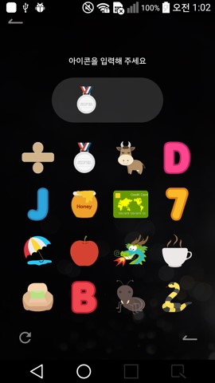  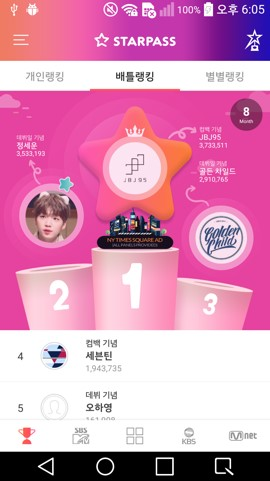 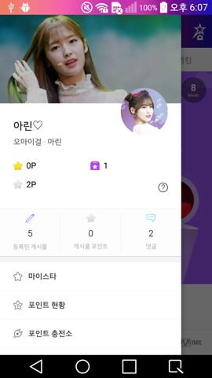 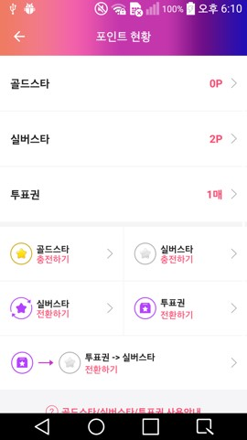 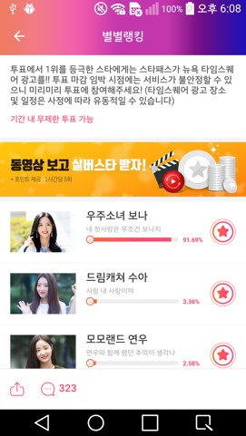
***

>[네트워크OnS](https://play.google.com/store/apps/details?id=com.eksys.networkons)
>* 차량 관제 애플리케이션
>* 개발 기간 : 2017.04 ~ 2017.08
>* 사용 기술 : Java, SVN, BLE(Beacon), Volley, SQLite

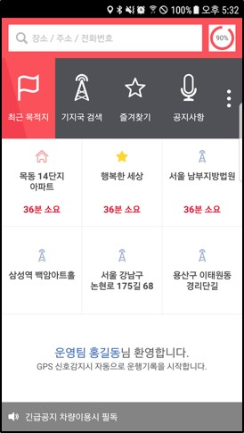    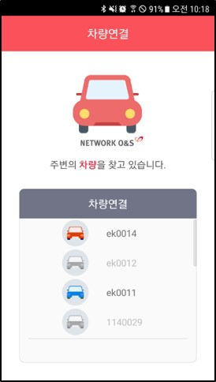  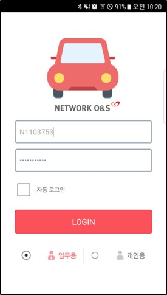 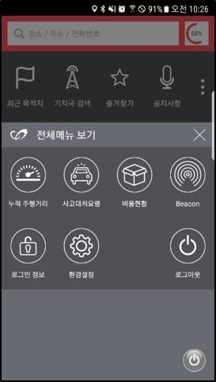 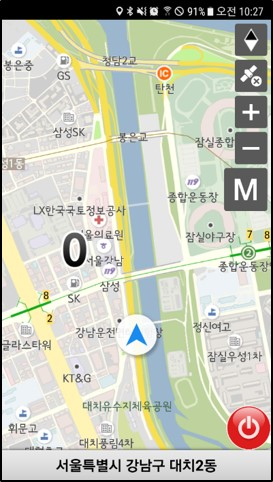
***

>비콘 매니저
>* 비콘 관리 애플리케이션
>* 개발 기간 : 2015.09 ~ 2015.12
>* 사용 기술 : Java, Github, Volley, BLE(Beacon), 비콘 제조사 SDK 연동

    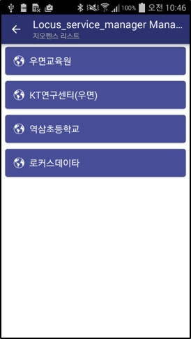   
***

>그외
>* 모플라이(모바일 쇼핑몰앱 출시 및 광고 서비스) (2016.02 ~ 2016.10)
>* 광고 노출 SDK (웹뷰 이용 특정 액션) (2016.07 ~ 2016.10)
>* 상태바 상주 광고 서비스 (2016.03 ~ 2016.10)
>* T멤버십 서비스 애플리케이션 개발 (2014.11 ~ 2015.07)
>* 식단 정보 제공 애플리케이션 개발 (2014.06 ~ 2014.10)
>* 보안 카드 관리 애플리케이션 개발 (2013.11 ~ 2014.05)
>* 쿠폰 서비스 애플리케이션 개발 (2013.04 ~ 2013.10)
>* 신한카드 스마트월렛 애플리케이션 개발 (2012.03 ~ 2013.03)
>* 민트마켓 (중고거래 서비스) 애플리케이션 개발 (2011.12 ~ 2012.02)
>* 한국전기안전공사 모바일 오피스 애플리케이션 개발 (2011.10 ~ 2011.12)
>* Android 2.2 애플리케이션 포팅 패드용 (2010.12 ~ 2011.02)
>* Android 2.1 애플리케이션 포팅 (2010.06 ~ 2011.05)

***

## 개인 프로젝트
>[노티메모](https://play.google.com/store/apps/details?id=kr.znc.app.sendnoti)
>* 노티 영역에 간단한 메모 노출
>* 개발 기간 : 2019.04 ~ 2019.04
>* 사용 기술 : Kotlin, Github, Room

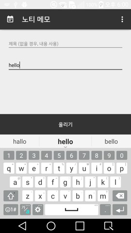       
***

> [비번관리](https://play.google.com/store/apps/details?id=kr.znc.app.znpasswordmanager)
>* 비밀번호 관리 애플리케이션 (사용자 설정 암호 기반 데이터 암호화)
>* 개발 기간 : 2017.11 ~ 2017.12
>* 사용 기술 : Java, Github, SQLite, AES-256, SHA-512

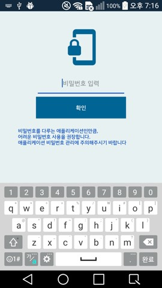    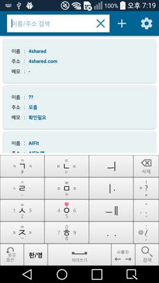   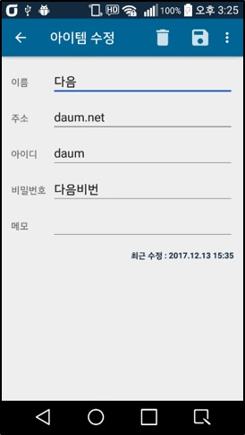 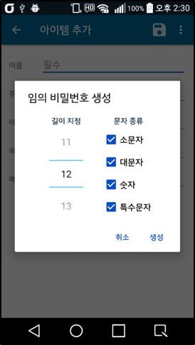 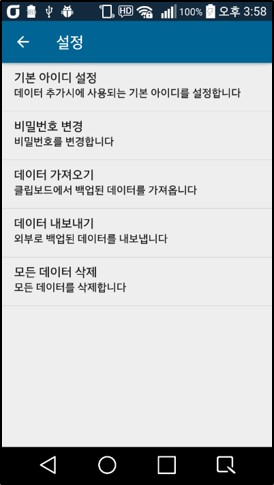
